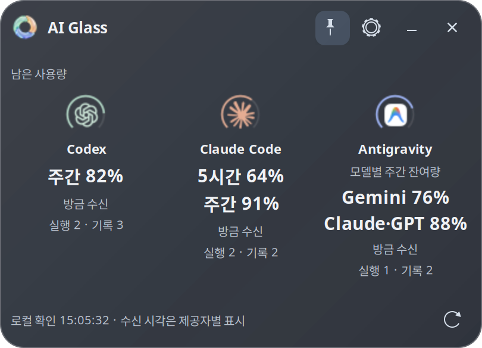
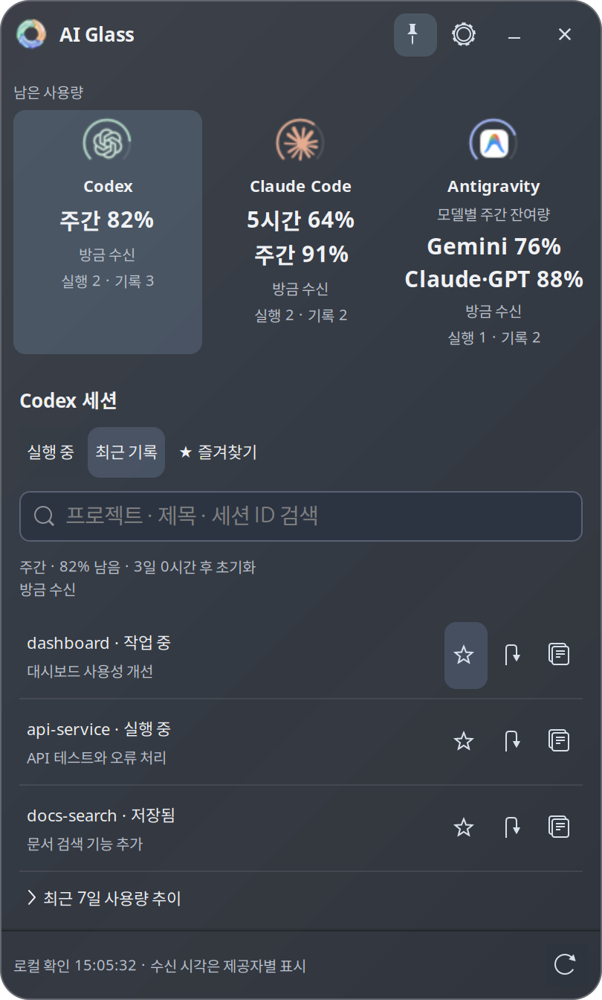
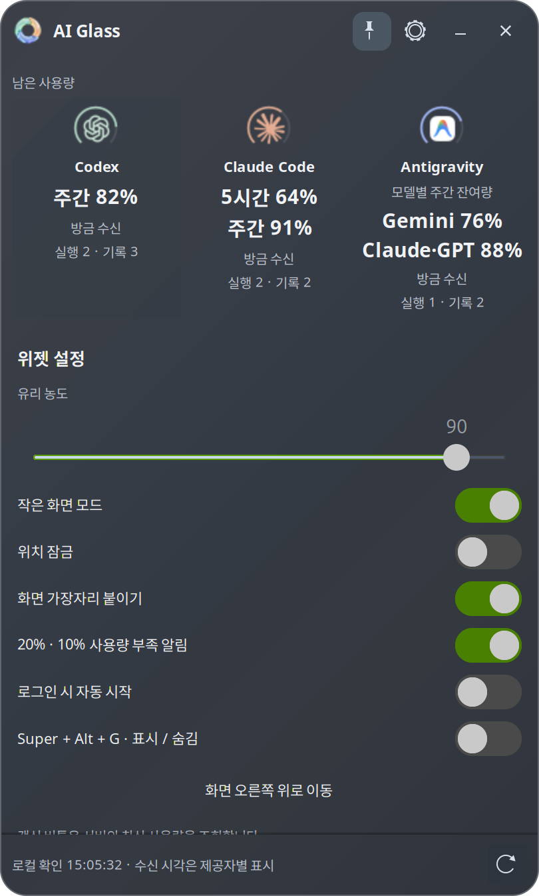

# AI Glass

Windows / Ubuntu 바탕화면에 띄우는 반투명 네이티브 위젯입니다.
Codex · Claude Code · Antigravity의 **잔여 사용량과 로컬 세션**을 확인합니다.
브라우저나 별도 서버를 실행하지 않습니다.

<p align="center">
  
</p>

<p align="center"><em>Ubuntu에서 촬영한 실제 앱 화면입니다. 사용량과 세션은 예시 데이터이며 Windows 버전은 UI에 일부 차이가 있습니다.</em></p>

## 다운로드

[GitHub Releases](https://github.com/pyoung527/ai-glass/releases)에서 OS에 맞는 파일을 받으세요.

| OS | 설치 파일 | 요구 환경 |
|---|---|---|
| Windows | `AI-Glass-1.0.0-windows-x64-setup.exe` | Windows 11 x64, 에이전트 Windows 직접 설치 |
| Linux | `ai-glass_1.0.0_amd64.deb` | Ubuntu 24.04+ x64, GNOME / X11 또는 XWayland |

Windows 설치본은 Python과 Qt를 포함하며 관리자 권한 없이 설치됩니다.
현재 코드 서명은 적용하지 않았습니다. WSL 에이전트는 지원하지 않습니다.
Linux 설치: `sudo apt install ./ai-glass_1.0.0_amd64.deb` 후 앱 목록의 **AI Glass**를 실행합니다.
다른 Linux 배포판은 소스 실행이 가능하지만 배포판별 검증은 하지 않았습니다.

세 에이전트 CLI는 위젯에 포함되지 않습니다. 사용할 CLI를 직접 설치하고
해당 OS의 터미널에서 먼저 로그인하세요. 구독이나 API 키를 위젯에 입력하지 않습니다.

## 사용

- 제공자 아이콘을 클릭하면 세션 목록이 열립니다. 실행 중 / 최근 기록, 검색, 즐겨찾기를 지원합니다.
- 세션을 클릭하면 확인 가능한 실행 창을 활성화하거나 저장된 세션을 CLI로 재개합니다.
  공유 터미널의 특정 탭은 식별하지 못할 수 있으며, 이 경우 직접 선택하도록 안내합니다.
- **↻** 버튼은 실제 서버 사용량을 조회합니다. 15초 자동 확인은 로컬 기록만 읽습니다.
- 제목 영역을 드래그해 이동합니다. 항상 위 표시, 투명도, 위치 잠금, 가장자리 붙이기,
  잔여량 20% / 10% 알림을 설정할 수 있습니다.
- Windows의 **−** 버튼은 트레이로 숨깁니다. 트레이 메뉴에서 다시 열거나 종료하세요.
- Ubuntu에는 작은 화면 모드, GNOME 전역 단축키 **Super + Alt + G**, 사용량 추이가 추가로 있습니다.
  Windows 첫 버전은 이 세 기능을 제공하지 않습니다.

Antigravity의 Gemini / Claude·GPT 한도는 **Antigravity 안에서 사용하는 모델 한도**입니다.
별도 ChatGPT·Claude 구독 한도와 합산하지 않습니다.
15분 이상 지난 수치는 갱신 필요로 표시하며, 초기화 시간이 지났다고 임의로 100%로 만들지 않습니다.

## 화면 미리보기

| 세션 목록 | 위젯 설정 |
|:---:|:---:|
|  |  |
| 프로젝트별 작업을 검색하고 즐겨찾기로 관리합니다. | 투명도·위치·알림을 바탕화면 환경에 맞게 조절합니다. |

## 조회 방식과 인증

| 제공자 | 서버 조회 | 로컬 세션 |
|---|---|---|
| Codex | CLI app-server `account/rateLimits/read` | `~/.codex/state_*.sqlite`, rollout |
| Claude Code | 기존 OAuth 토큰으로 `/api/oauth/usage` GET | `~/.claude/projects/` |
| Antigravity | `agy --print /usage` | `~/.gemini/antigravity-cli/` |

모델 생성 요청은 보내지 않습니다. Claude 토큰이 만료되면 CLI의 `/usage`를
POSIX PTY 또는 Windows ConPTY에서 실행해 CLI가 직접 갱신하게 합니다.
최초 폴더 신뢰 확인 등으로 자동 갱신이 멈추면 해당 CLI에서 `/usage`를 실행한 뒤 재조회하세요.
Linux Antigravity는 잠금 해제된 키링이 정상 응답할 때 과거 키링 실패 캐시를 해제합니다.
일반 조회는 약 20초, Claude 인증 갱신까지 포함하면 약 50초의 대기 시간이 있을 수 있습니다.

조회 인터페이스와 로컬 파일 형식은 제공자 업데이트로 바뀔 수 있습니다.
[Antigravity /usage](https://antigravity.google/docs/cli/commands/usage),
[PyWinpty](https://github.com/andfoy/pywinpty),
[Qt Windows 배포](https://doc.qt.io/qtforpython-6/deployment/deployment-pyinstaller.html).

## 데이터와 개인정보

사용량 캐시·설정·즐겨찾기·로그는 사용자 PC에만 저장합니다.
인증 토큰을 사용량 캐시나 로그에 기록하지 않으며 원격 수집 서버나 텔레메트리를 두지 않습니다.
사용량 조회 시 해당 제공자의 서버에 인증된 요청을 보냅니다.

- Windows: `%LOCALAPPDATA%\AI Glass`
- Linux 설치본: `${XDG_DATA_HOME:-~/.local/share}/ai-glass`
- Git 체크아웃: 프로젝트의 `data/`
- 테스트 / 별도 저장소: `AI_GLASS_DATA_DIR`로 변경 가능

CLI의 홈 경로는 `CODEX_HOME`, `CLAUDE_CONFIG_DIR`, `ANTIGRAVITY_CONFIG_DIR`을 따릅니다.
Windows와 Linux의 설치 폴더는 사용자 데이터 저장에 사용하지 않습니다.
문제 신고 시 인증 파일·원본 세션·개인 프로젝트 경로를 첨부하지 마세요.

## 소스 실행과 검증

Ubuntu:

```sh
sudo apt install python3-gi gir1.2-gtk-3.0 gir1.2-wnck-3.0 librsvg2-common xterm
./start.sh
GSETTINGS_BACKEND=memory /usr/bin/python3 -m unittest discover -s tests -v
GSETTINGS_BACKEND=memory /usr/bin/python3 tests/ui_checks.py
/usr/bin/python3 packaging/build_linux.py
```

Windows (PowerShell, Python 3.12):

```powershell
python -m venv .venv
.venv\Scripts\python -m pip install -r requirements-windows.txt
.venv\Scripts\python windows_app.py
.venv\Scripts\python -m unittest discover -s tests -v
$env:QT_QPA_PLATFORM = 'offscreen'
.venv\Scripts\python tests/windows_ui_checks.py
```

Windows 설치 파일 빌드에는 Inno Setup 6도 필요합니다.
`python packaging/build_windows.py`로 실행 파일 묶음과 설치 프로그램을 만듭니다.
CI는 각 OS에서 테스트·패키징·설치본 스모크 검사를 수행합니다.
`VERSION`과 동일한 `v` 태그를 푸시하면 양쪽 빌드가 통과한 파일과 SHA256 체크섬을
GitHub 프리릴리스에 업로드합니다. 실제 구독 계정 검증은 CI 모의 테스트와 별개입니다.

Ubuntu 상태 표시줄 연결은 선택 사항입니다. 기존 설정을 보존합니다:

```sh
python3 scripts/statusline_bridge.py --install
python3 scripts/statusline_bridge.py --antigravity --install
# 연결 해제 시 기존 명령 복원
python3 scripts/statusline_bridge.py --uninstall
python3 scripts/statusline_bridge.py --antigravity --uninstall
```

## 라이선스

앱 코드: [ISC](LICENSE). 의존성과 제공자 아이콘: [제3자 고지](THIRD_PARTY_NOTICES.md).
OpenAI, Anthropic, Google과 무관한 독립 프로젝트입니다.
